# CAS PRÀCTIC 1

## ÍNDEX

- INTRODUCCIÓ
- PERQUÈ ÉS UNA BONA SOLUCIÓ?	
- TIPUS DE CÒPIES DE SEGURETAT	
- CÒPIA DE SEGURETAT COMPLETA	
- AVANTATGES DE LES CÒPIA DE SEGURETAT COMPLETA	
- DESAVANTATGES DE LAS CÒPIA DE SEGURETAT COMPLETA	
- CÒPIA DE SEGURETAT INCREMENTAL	
 -AVANTATGES DE LA CÒPIA DE SEGURETAT INCREMENTAL	
- DESAVANTATGES DE LA CÒPIA DE SEGURETAT INCREMENTAL	
- CÒPIA DE SEGURETAT DIFERENCIAL	
- AVANTATGES DE LA CÒPIA DE SEGURETAT DIFERENCIAL	
- DESAVANTATGES DE LA CÒPIA DE SEGURETAT DIFERENCIAL	
- COM TENIR MILLOR ÚS DEL NÚVOL	
- PRESSUPOST	
- GUIA DE CREACIÓ DE L’USUARI ADMINISTRATIU I USUARI	
- CREACIÓ D’UNITATS COMPARTIDES BACKUP I DOCUMENTS	
- INSTAL·LACIÓ D’ADRECES DIRECTES ALS ESCRIPTORIS	
- BACKUP PER PART DE L’ADMINISTRADOR	
- CONSULTAR DOCUMENT PER PART DE L’USUARI	
- COMPROVACIÓ ELIMINACIÓ DOCUMENT	
- CONCLUSIONS	

## INTRODUCCIÓ

Som els encarregats de fer les còpies de seguretat de la documentació de la nostra empresa. Actualment les fèiem en una màquina local situada a les oficines on està l’empresa.

La setmana passada el disc dur que feiem servir per fer les còpies ens va deixar de funcionar i hem perdut tota la informació acumulada. No ha passat res perquè la documentació la guarden tots els empleats a la seva màquina personal en local.

Tot i això, és un problema preocupant. Així com a persones responsables vam decidir informar als nostres superiors sobre el problema. Vam proposar una solució d’emmagatzematge al núvol, a més a més, apart de l’emmagatzematge al núvol també les faríem amb local, per així tenir més seguretat amb la informació de l’empresa.

A continuació explicarem com hem solucionat aquest problema.

## PERQUÈ ÉS UNA BONA SOLUCIÓ? 

Creiem que aquesta és una bona solució, ja que d’aquesta manera podem evitar problemes com el que se’ns planteja a aquesta pràctica. Una de les avantatges que tenim al fer una còpia al núvol és que no haurem de tenir un gast econòmic per comprar hardware.

El fet de tenir les còpies de seguretat al núvol, és que el treball sigui més ràpid i eficient per al nostre ordinador, perquè això fa que es redueixi l’espai d’almacenament als servidors i per tant augmentarà la velocitat a la plataforma que la nostra empresa utilitza.

Amb les còpies de seguretat al núvol podrem tenir la nostra informació sempre disponibles a Internet. Apart podrem alliberar espai del disc dur del nostre dispositiu, ja sigui PC, mòbil, tauleta…

Gràcies a això podem accedir a la nostra informació desde qualsevol lloc i desde qualsevol dispositiu.

## TIPUS DE CÒPIES DE SEGURETAT

### CÒPIA DE SEGURETAT COMPLETA

Se realiza una copia de todos los archivos y carpetas que se han seleccionado. Cuando se selecciona por defecto la copia de seguridad completa, la próxima vez que se ejecute la copia de seguridad volverán a copiarse todos los archivos y carpetas que se habían seleccionado.

#### AVANTATGES DE LES CÒPIA DE SEGURETAT COMPLETA

- Disposeu d'una còpia de seguretat completa de totes les dades que podeu recuperar ràpidament i fàcilment.
- Tens una còpia de seguretat de tots els fitxers i carpetes en una unitat de seguretat.
- És fàcil portar un control de versions dels fitxers copiats.

#### DESAVANTATGES DE LAS CÒPIA DE SEGURETAT COMPLETA

- Tarda més temps a fer-se la còpia completa ja que ha de posar tots els fitxers.
- És necessari més espai d'emmagatzematge que en els altres tipus de còpies de seguretat.
-Cal amplada de banda addicional.

### CÒPIA DE SEGURETAT INCREMENTAL

A la còpia de seguretat incremental es copien tots els fitxers que han canviat des de la darrera còpia de seguretat que es va realitzar ja fos una còpia completa o una còpia incremental.

#### AVANTATGES DE LA CÒPIA DE SEGURETAT INCREMENTAL

- La còpia de seguretat es realitza en menys temps que una còpia completa ja que les dades a copiar són menors (només les que han canviat).
- Cal menys espai d'emmagatzematge.
- Podeu desar diverses versions del mateix fitxer.

#### DESAVANTATGES DE LA CÒPIA DE SEGURETAT INCREMENTAL

- La recuperació és més lenta. Per restaurar la còpia d'un dia determinat has de restaurar la darrera còpia completa i tots els increments posteriors fins arribar a la còpia del dia que vols.
- Per a la recuperació necessites la còpia completa i les còpies incrementals posteriors.
- També és més lenta la restauració d'un fitxer en particular ja que has de buscar a totes les còpies incrementals a veure si ha canviat o no.
- Si falla alguna de les còpies de seguretat (ja sigui la completa o una de les incrementals) no serà possible fer-ne la recuperació.

### CÒPIA DE SEGURETAT DIFERENCIAL

A diferència de la còpia incremental, a cada còpia de seguretat diferencial es fa una còpia de tots els fitxers que s'han modificat des de l'última còpia completa.

#### AVANTATGES DE LA CÒPIA DE SEGURETAT DIFERENCIAL
- Cal menys espai d'emmagatzematge.
- La còpia de seguretat es realitza en menys temps que una còpia completa ja que les dades a copiar són menors (només les que han canviat).
- Podeu desar diverses versions del mateix fitxer.
- Per restaurar una còpia només cal la còpia completa i la diferencial del dia que vols restaurar.

#### DESAVANTATGES DE LA CÒPIA DE SEGURETAT DIFERENCIAL
- La còpia de seguretat és més lenta que la còpia incremental
- Per a la recuperació necessites la còpia completa i la còpia diferencial.
- Si falla les còpies de seguretat completa o la diferencial no serà possible fer la recuperació.
- La restauració d'un fitxer en particular és més lenta que en una còpia completa ja que has de restaurar primer la còpia completa i després cercar el fitxer a l'última còpia diferencial.

## COM TENIR MILLOR ÚS DEL NÚVOL 

Més allà de la gran utilitat que tenen aquests serveis, també tenim que tenir cura de com l’utilitzem i amb quina seguretat ho fem, ja que no volem que la nostra informació i les nostres dades acabin interceptades en mans de terceres persones. 

Per tant és interessant tenir una especial cura de cara a aquests serveis per a tenir tota la seguretat possible. Aquests són alguns conceptes que hauriem de seguir per tenir-la:

- Utilitzar contrasenyes fortes
- Autenticació en dos passos
- Xifrar els fitxers que pugem
- Mantenir actualitzades les eines
- Usar només serveis oficials i fiables
- Configurar paràmetres de seguretat
- Mantenir el sistema segur

## PRESSUPOST

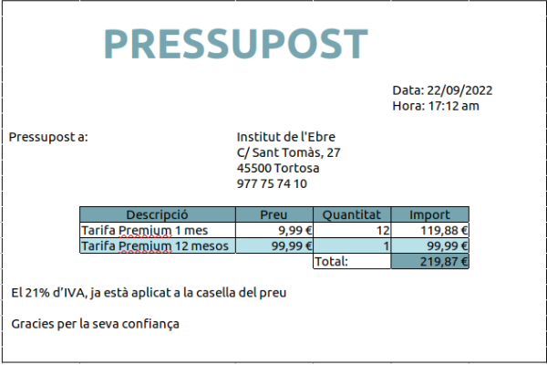

Aquí us deixem l’enllaç del pressupost: 	[enllaç](https://www.example.com)

Tenim que tenir en compte que no apliquem el 21% del IVA, ja que ja està aplicat al preu.

##GUIA DE CREACIÓ DE L’USUARI ADMINISTRATIU I USUARI

Des del compte de l'institut no podem canviar el compte d’usuari a usuari administratiu ja que no tenim el domini i no ho podem gestionar. En canvi, sí que ho podem gestionar si creem un document, d’aquesta manera un seria el propietari i l’altre usuari podria editar, llegir o comentar. Aquí us deixem el missatge que ens ha sortit, quan anàvem a passar d’usuari a usuari administrador. 

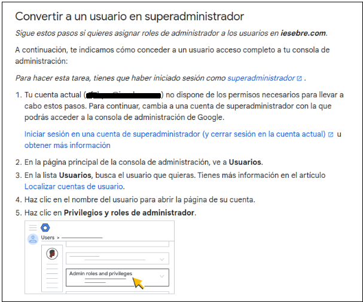

## CREACIÓ D’UNITATS COMPARTIDES BACKUP I DOCUMENTS

Per crear una unitat compartida el que farem serà anar al google drive i anirem a l’apartat de unitats compartides. Quan estem allí crearem una unitat compartida.

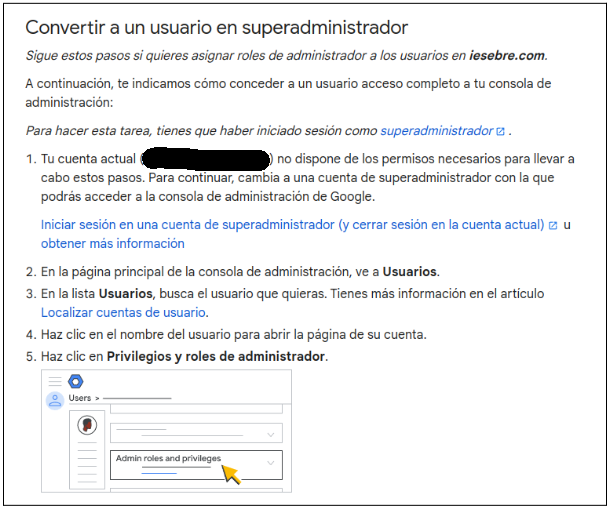

Un cop la tenim creada ens sortirà així:

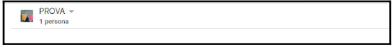

Ara el que farem serà posar a la gent i podrem triar q volem que sigui cada usuari.

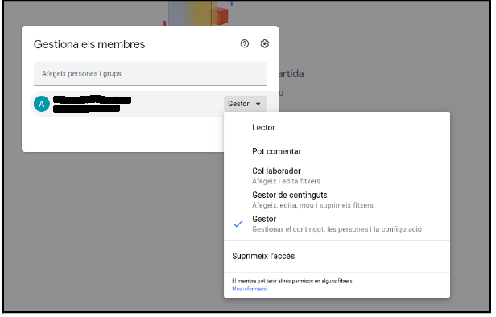

Un cop tenim això ja tindrem la nostra unitat compartida creada. 

## INSTAL·LACIÓ D’ADRECES DIRECTES ALS ESCRIPTORIS

Per instal·lar les adreces directes a l'escriptori, el que farem serà anar a paràmetres, un cop allí anirem a l’apartat de comptes en línea i ens sortirà això.

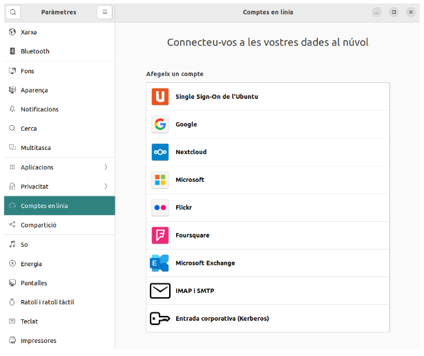

Anirem a afegir un compte amb google, haurem de posar el correu i la contrasenya.

Un cop fet això ens sortirà aquest missatge i ho permetrem.

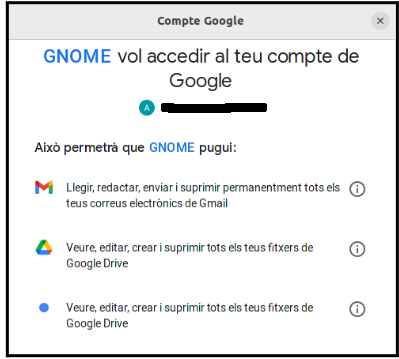

Un cop ho hem permès ens sortirà això, seleccionarem el que volguessin que ens surti al ordenador. En el nostre cas deixarem que ens arribin els correus i que poguessim veure els fitxers que tenim al drive. 

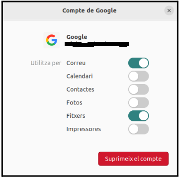

## BACKUP PER PART DE L’ADMINISTRADOR

Buscarem a Google “Google Takeout” i entrarem al primer enllaç:

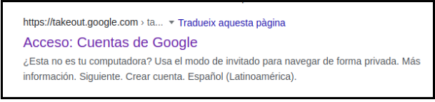

A continuació seleccionarem tots els arxius dels quals volem que formen part de la còpia de seguretat:

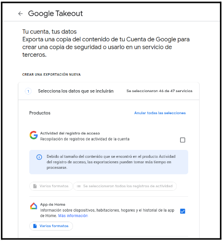

Quan acabessim de seleccionar tots els arxius un a un, li donarem a següent pas:

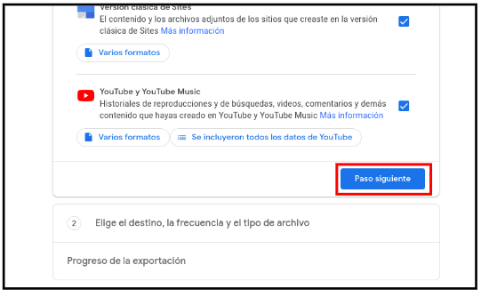

Un cop seleccionats els arxius, tirarem el destí d’origen (en el nostre cas Drive), la freqüència i el tipus d’arxiu.

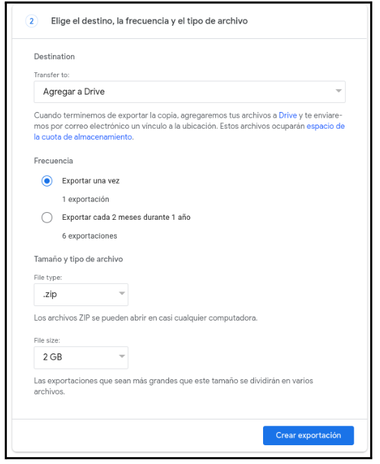

Un cop fet això li donarem al botó ”Crear exportación” i començarà el procés.

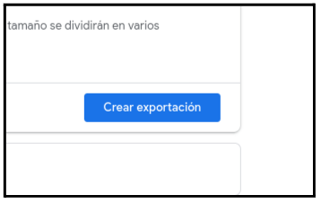

Un cop començat el procés ens sortirà aquest missatge.

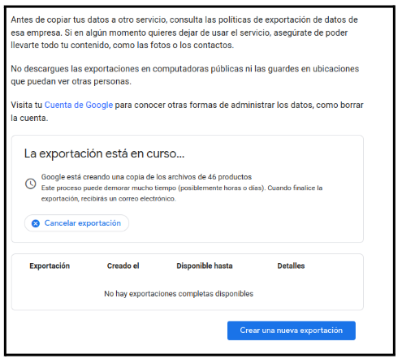

Per veure on se’ns ha guardat la còpia de seguretat, anirem a “Emmagatzematge” i seguidament entrarem a “Còpies de seguretat” situat a la part superior dreta de la pantalla:

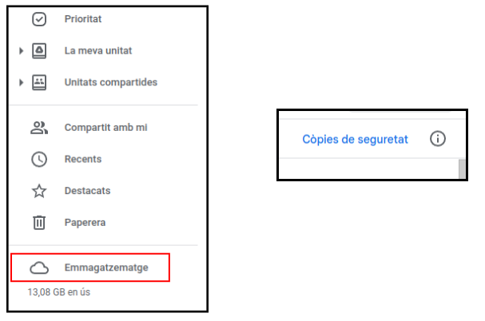

Una vegada fet això, tindrem la còpia de seguretat feta i tindrem l'accés a totes les còpies de seguretat que haguessim fet.

## CONSULTAR DOCUMENT PER PART DE L’USUARI

Per consultar un document per part de l’usuari, el que haurem de fer serà, anar al drive i anar a l’apartat d’unitats compartides, un cop dintre, el que farem serà obrir la carpeta que ha creat l’administrador i ja podrem consultar tots els documents que hi han a l’unitat compartida. 

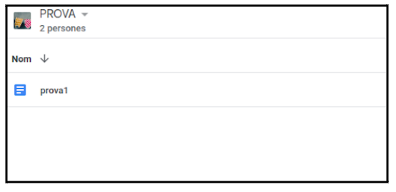

## COMPROVACIÓ ELIMINACIÓ DOCUMENT

Un usuari pot eliminar documents depèn del permís que tingui. Si té el permís com a gestor de continguts, podrà afegir, editar, moure i suprimir documents. 
En canvi, si té el permís de col·laborador, només podrà afegir i editar documents. 
Si només té el permís de comentar, només podrà comentar i llegir el document i si té el permís de lector només podrà llegir el document. 

## CONCLUSIONS

En conclusió, hem vist que la millor forma per guardar informació són les còpies de seguretat al núvol ja que és més ràpid, pràctic i efectiu,  ja que pots accedir als teus arxius i informació desde qualsevol lloc. Apart no haurem de comprar ni portar damunt discs durs externs per accedir a les nostres dades.

Si volguessim més seguretat el que hauríem de fer sería fer les còpies de seguretat amb hardware i a la vegada al núvol.
