# OWNCLOUD

OwnCloud és una aplicació de programari d'allotjament de fitxers, que permet l'emmagatzematge i aplicacions al núvol. Permet tenir un control total sobre els fitxers de la d'empresa, com saber on s'ubiquen les dades a més de dir qui i qui no tens accés a carpetes i fitxers.

## REQUISITS PREVIS

- Apache
- MariaDB
- Crear la base de dades de Owncloud
- Instal·lar PHP i els seus moduls necessaris

### INSTAL·LACIÓ APACHE

- Primer de tot instal·larem l'Apache2. Per fer-ho posarem la següent comanda: 

"sudo apt install apache2"

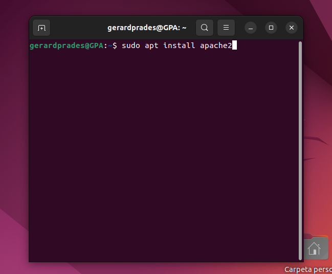

- A continuació  mirarem l'estat del Apache amb la següent comanda 

"sudo apache2 status"

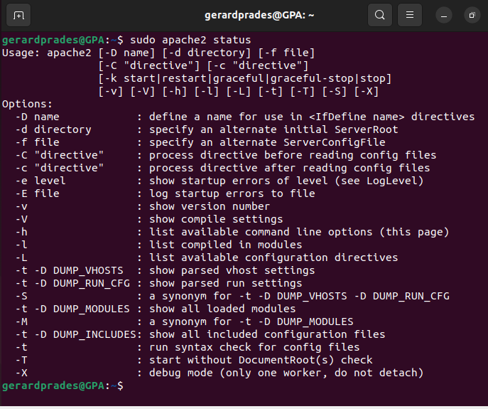

- Seguidament, entrarem al directori "/var/www/html" i desactivarem el llistat de directoris del servidor amb la següent comanda:

"sudo sed -i "s/Options Indexes FollowSymLinks/Options FollowSymLinks/" /etc/apache2/apache2.conf"

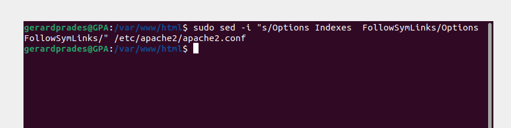

### INSTAL·LACIÓ MARIADB

- Per començar instal·larem el MariaDB amb la següent comanda: 

"sudo apt-get install mariadb-server mariadb-client -y"

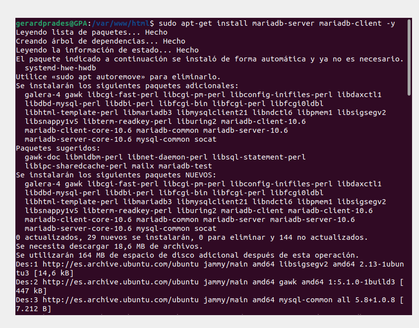

- Seguidament configurarem la instal·lació:

"sudo mysql_secure_installation"
Una vegada hem posat la comanda ens demanarà la contrasenya del sistema ubuntu per entrar al root.

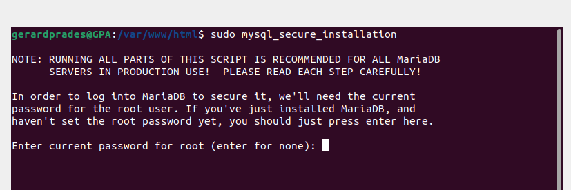

- Ens preguntarà si volem canviar al socket de unix. Li posarem que no "n":

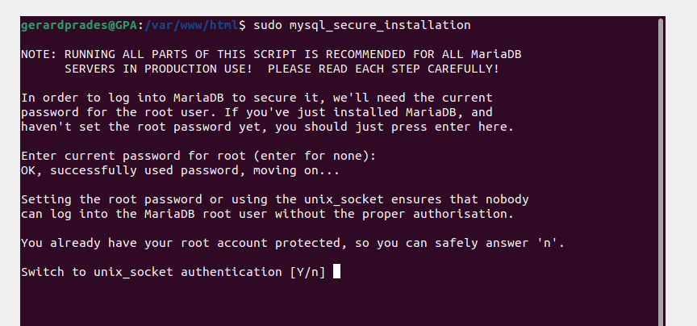

- Seguidament ens preguntarà si volem canviar la contrasenya de root. Li direm que no "n":

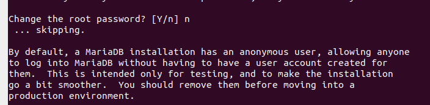

- A continuació ens preguntarà si volem eliminar els usuaris anonims. Li direm que si "y"

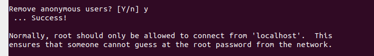

- Ens preguntarà si volem deshabilitar l'acces remot com a root. Li direm que no "n":

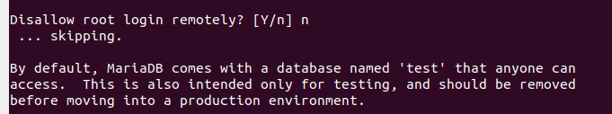

- Ens preguntarem si volem eliminar les base de dades de testeig i l'accés. Li direm que si "y":

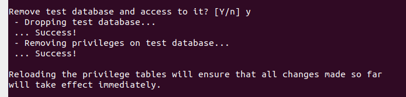

- Finalment ens preguntarà si volem actualitzar les taules de privilegis. Li direm que si "y":

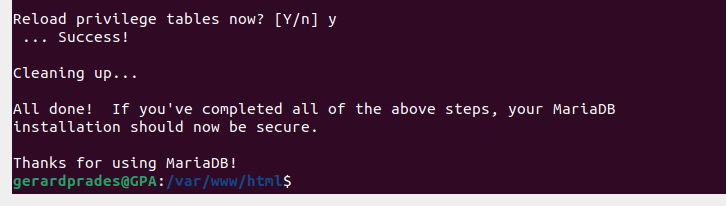

- Y per últim reiniciarem el MariaDB amb la següent comanda:

"sudo systemctl restart mariadb.service` o `sudo service mariadb.service restart"

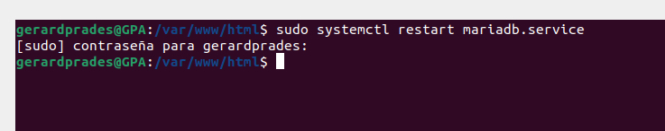

## CREACIÓ DE LA BASE DE DADES DE OWNCLOUD

- Primer de tot entrarem a MariaDB amb la següent comanda:

"sudo mysql -u root -p"

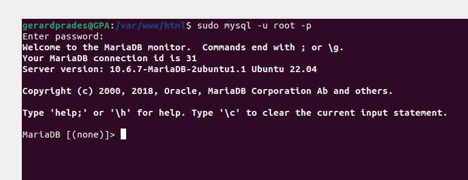

- Crearem la base de dades amb la següent comanda:

"CREATE DATABASE owncloud;"

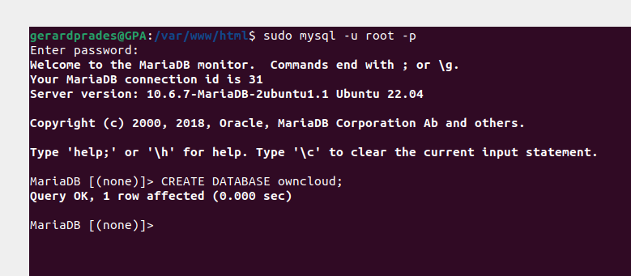

- A continuació crearem un usuari anomenat ownclouduser amb la contrasenya "Admin1234" amb la següent comanda:

"CREATE USER 'ownclouduser'@'localhost' IDENTIFIED BY 'Admin1234';"

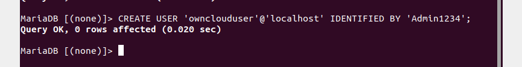

- Li donarem accès a la base de dades al usuari amb la següent comanda:

"GRANT ALL ON owncloud.* TO 'ownclouduser'@'localhost' IDENTIFIED BY 'Admin1234' WITH GRANT OPTION;"

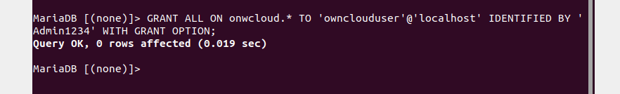

- Aplicarem els canvis i sortirem. Li posarem les següents comandes:

"FLUSH PRIVILEGES;
EXIT;"

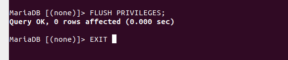

## INSTAL·LACIÓ PHP AMB ELS SEUS MÓDULS NECESSARIS

- Primer de tot ho instal·larem amb les següents comandes:

"sudo apt-get install software-properties-common -y
sudo add-apt-repository ppa:ondrej/php"

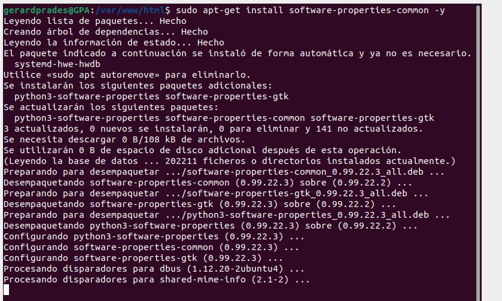
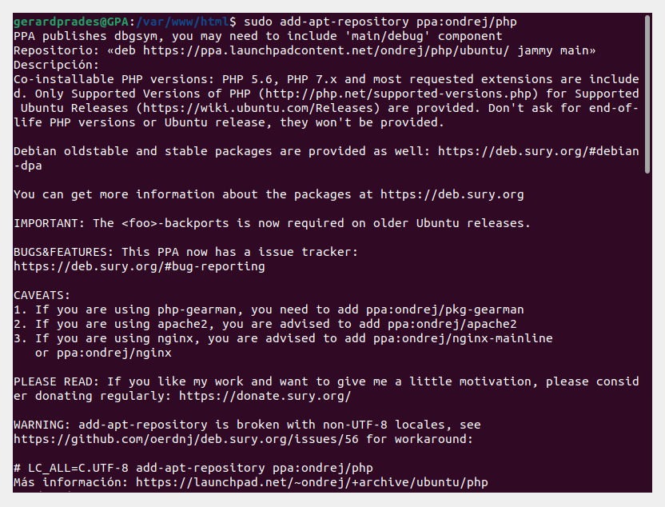

- Instal·larem el PHP y els seus móduls necessaris. Hem de tenir en compte els requisits de Owncloud abans de instal·lar els móduls. Posarem la següent comanda:

"sudo apt install php7.4 libapache2-mod-php7.4 php7.4-common php7.4-mbstring php7.4-xmlrpc php7.4-soap php7.4-apcu php7.4-smbclient php7.4-ldap php7.4-redis php7.4-gd php7.4-xml php7.4-intl php7.4-json php7.4-imagick php7.4-mysql php7.4-cli php7.4-mcrypt php7.4-ldap php7.4-zip php7.4-curl -y
"
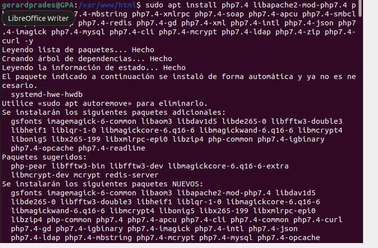

- Actualitzarem els paquets amb el repositori afegit amb la següent comanda:

"sudo apt update"

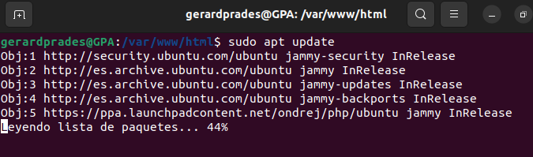

- Después de la instal·lació editarem el fitxer php.ini i canviarem alguns valors. Li posarem la següent comanda:

"sudo gedit /etc/php/7.4/apache2/php.ini"

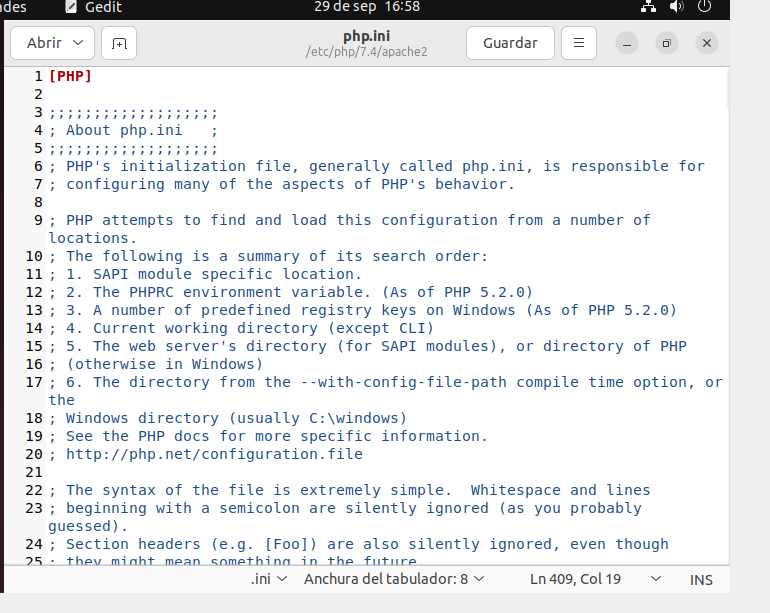

- Una vegada ens ha entrat al bloc de notes, li canviarem la memória limit de 128 a 256 i guardarem:

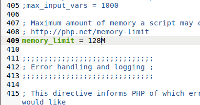
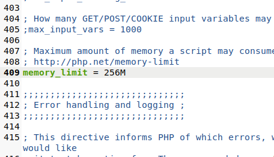

## INSTAL·LACIÓ OWNCLOUD

- Descargarem la última versió del programa y descomprimirem els fitxers, ademés mourem els arxius de Owncloud a "/var/www/html/owncloud"
