# Activitat 3:

Per fer aquesta activitat comptem amb que **ja s'ha configurat el servei Owncloud a una Màquina Virtual** (MV).

**3.1.-** Llista els Virtual Hosts d'Apache per tal de veure si **owncloud.XYZ.com** està habilitat amb la comanda:

```
apache2ctl -S
``` 

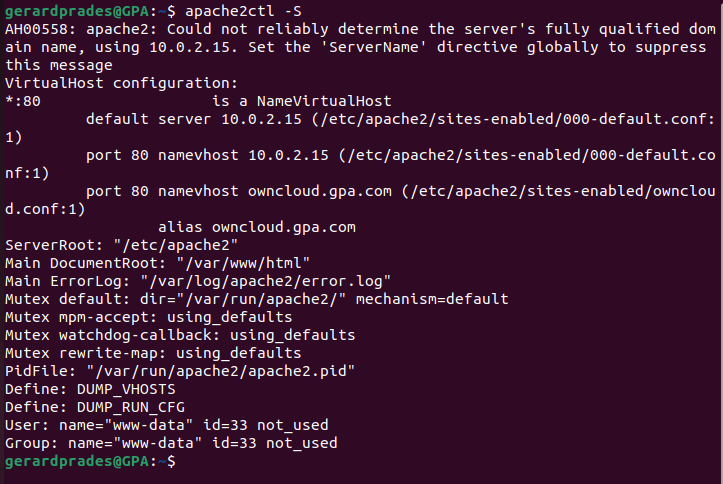


**RESPOSTA**

**3.2.-** A Owncloud podem veure que hi ha una serie de carpetes per defecte, mostra la ruta real a les tres carpetes dins de la teva MV.

#### - La ruta es:
```
/var/www/html/owncloud/core/skeleton
```

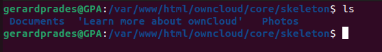
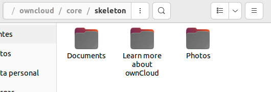


**RESPOSTA**

**3.3.-** Al directori **Learn more about owncloud** hi ha informació en forma de fitxers pdf. Consulta'ls i respon aquestes preguntes:

#### - Quin són els tres tipus de protecció de dades que ofereix Owncloud?

Els tres tipus de protecció de dades de owncloud és:
- Encryption in Transit (Cifrado en tránsito)
- Encryption at Rest i  Encryption at Rest with Master
Key in Hardware Security Module
(HSM) (Cifrado en reposo)
- End-to-End Encryption (Encriptado de fin a fin)

#### - Fes una petita descripció de cada un d'ells.

- El Encryption in Transit o cifrado en tránsito, assegura owncloud utilitzant HTTPS aprofitant el protocol TLS més nou amb el que tots els navegadors i clients poden suportar.
- Encryption at Rest i  Encryption at Rest with Master, xifra tots els arxius desde el servidor d'aplicacions Owncloud abans de guardarlo a l'almacentament real.
- End-to-End Encryption és el nivell més alt de confidencialitat de dades convinada amb el més alt nivell de protecció de dades. És la única solució que pot pretendre assegurar-ho
cap tercer no autoritzat pot accedir
les dades xifrades, ni tan sols el sistema
administradors.

#### - Per quina raó ens recomana utilitzar Owncloud per als documents de Microsoft Office de la nostra empresa?

- Perquè d'aquesta manera els documents estan guardats a un lloc segur i és molt dificil que se'ns perdin.

#### - Això passa a tots els països?

- 

#### - Quina és la llicència d'OWncloud Enterprise?

- AGPLv3 (ha de compartir personalitzacions amb la comunitat)

#### - I la d'Owncloud Standard?

- Llicència comercial ownCloud per als mòduls empresarials i empresarials d'ownCloud Server

#### - Es poden veure videos en Streaming directament des de Owncloud?

- Sí, desde el seu últim llançament.

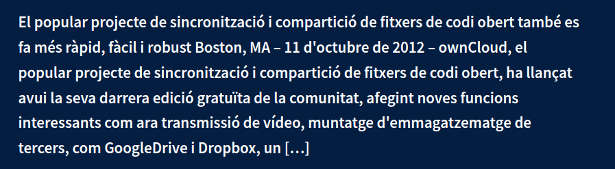

#### - Es poden connectar directoris de Google Drive a Owncloud?

- Sí, és poden connectar els directoris de Google Drive.

#### - I Dropbox?

- Sí, també es pot connectar.

#### - Compta Owncloud amb antivirus? En cas afirmatiu com es diu? 

- Sí, a través del protocol ICAP 

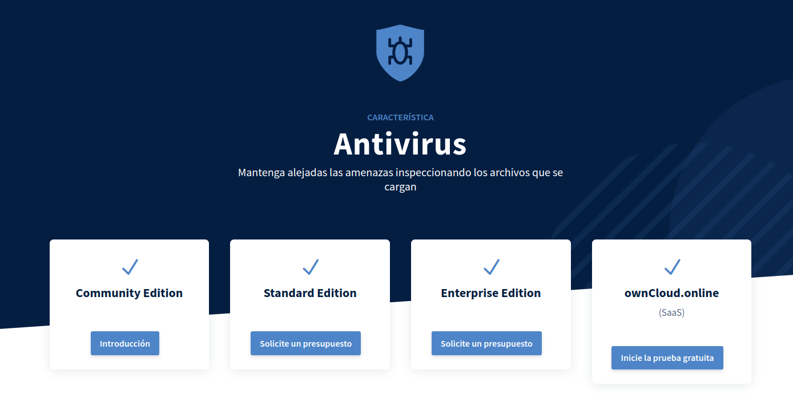
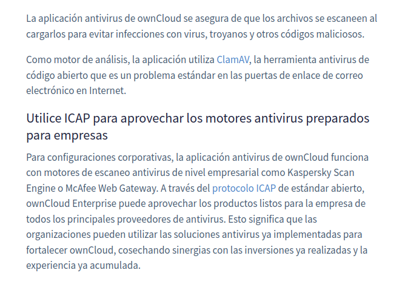

**RESPOSTA**

**3.4.-** Mostra els següents canvis de paràmetres d'usuari:

#### - Posa't una imatge d'usuari.

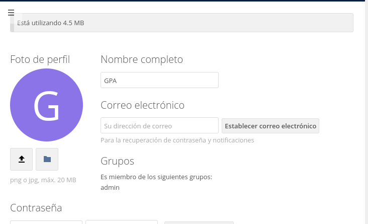
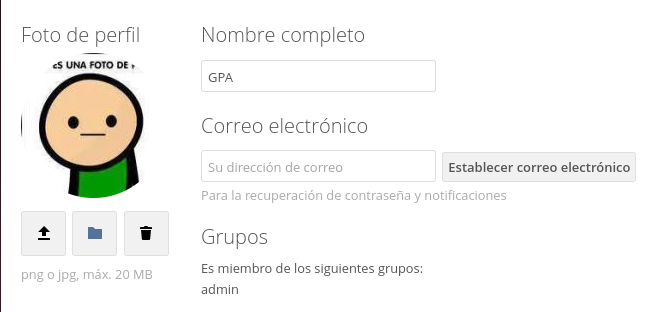

#### - Afegeix el teu mail de l'Institut.


#### - Canvia l'idioma a català.

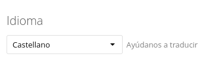
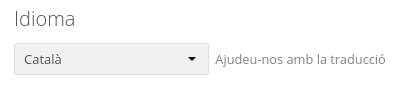

#### - Mostra la versió d'Owncloud instal·lada.

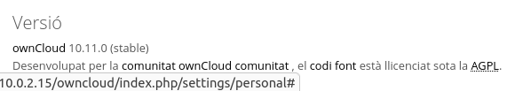

**RESPOSTA**


